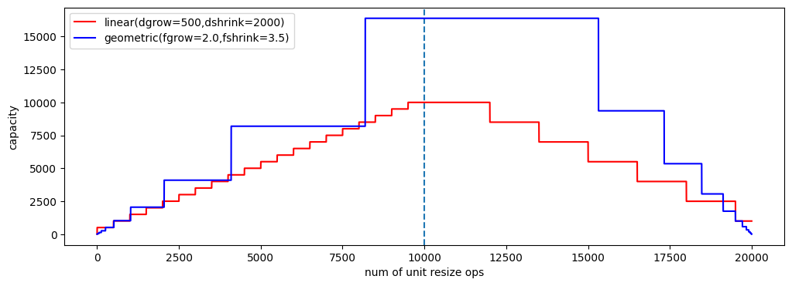

## Lab `dynamic-arrays` (2024-11-18): array dinamici

1. [Tempo stimato: 60'] Array dinamici
    - **Studiare** il sorgente `dynamic_arrays.c`, in particolare:
            - si compili (e.g. `gcc asd-labd/dynamic-arrays/dynamic-arrays.c`) ed **esegua** il codice (e.g. `./a.out`) e si cerchi di comprendere l'output; se l'output non torna, si noti che la funzione di `test` sfrutta funzioni **ancora da implementare**.
            - si osservi funzioni rilevanti, tra cui: `darray_print`, `darray_resize_linear`, `darray_resize_geometric`
    - **Completare il sorgente implementando le seguenti funzioni**:
        - **`darray_append`**: atta ad aggiungere alla fine dell'array un elemento (ridimensionando l'array)
        - **`darray_insert`**: atta ad aggiungere alla posizione indicata un nuovo elemento (traslando opportunamenti quelli attualmente presenti)
        - **`darray_assert_equals`**: atta a verificare con asserzioni che l'array dinamico indicato ha lo stesso contenuto dell'array "tradizionale" fornito
    - Si noti la funzione di `test()` che viene invocata ed eseguita attivando le due modalità di espansione dell'array
    - Nota: si compili con `gcc -DDEBUG dynamic_arrays.c` per attivare log di debug e ispezionare il comportamento delle funzioni di riallocazione
2. [Tempo stimato: 30'] In Python, utilizzare `matplotlib` per graficare come evolve la capacità (memoria allocata) di un array dinamico utilizzando le due tecniche di espansione (lineare e geometrica).
    - Parametrizzare il codice rispetto ai delta, fattori, soglie di crescita/contrazione
    - Ovvero, si cerchi di riprodurre una figura tipo la seguente
    

